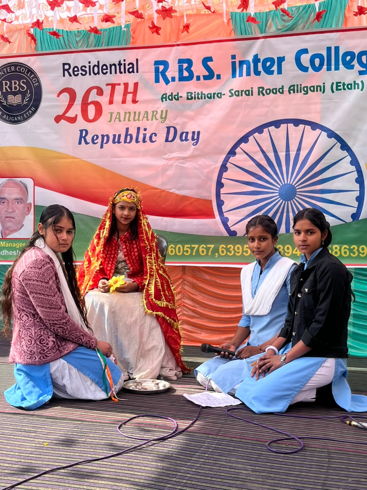
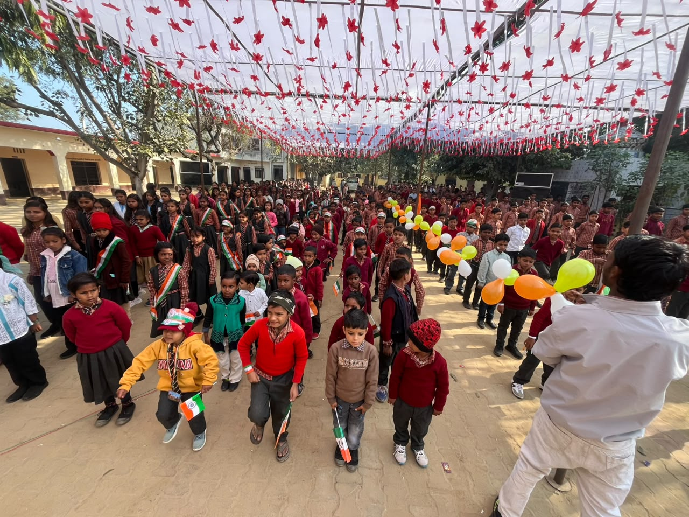
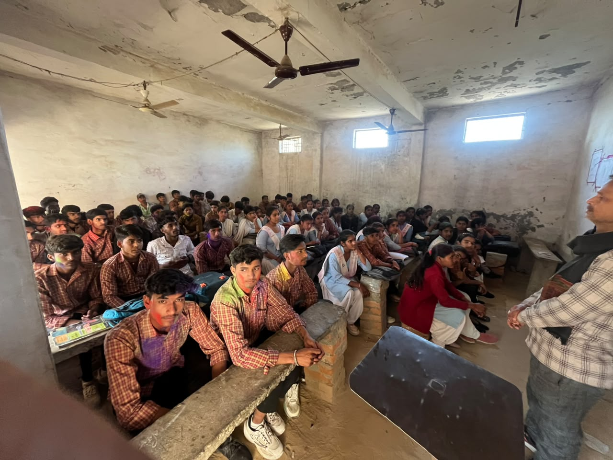

<!DOCTYPE html>
<html lang="hi">
<head>
  <meta charset="UTF-8" />
  <meta name="viewport" content="width=device-width, initial-scale=1.0" />
  <title>Rambax Singh Inter College (Residential/Hostel) - Bithara, Aliganj</title>
  
  <!-- DPS Mathura Road typography: Cinzel (Institutional Headings) & Outfit / Poppins (Clean Modern UI) -->
  <link rel="preconnect" href="https://fonts.googleapis.com">
  <link rel="preconnect" href="https://fonts.gstatic.com" crossorigin>
  <link href="https://fonts.googleapis.com/css2?family=Cinzel:wght@600;700;800;900&family=Outfit:wght@300;400;500;600;700&display=swap" rel="stylesheet" />
  <link rel="stylesheet" href="https://cdnjs.cloudflare.com/ajax/libs/font-awesome/6.4.0/css/all.min.css" />

  
</head>
<body>

  <!-- Top Contact Details -->
  

    

      <i class="fa fa-phone"></i> +91 6395052394 &nbsp;|&nbsp; 
      <i class="fa fa-map-marker-alt"></i> Bithara (Aliganj, Etah - 207247)
    

    

      <a href="javascript:void(0)" onclick="openAdminModal()"><i class="fa fa-user-shield"></i> Admin Portal Login</a>
    

  

  <!-- Header -->
  <header>
    

      
      

        <h1>Rambax Singh Inter College</h1>
        
Residential / Hostel Facility Available | Bithara, Aliganj (Etah)

      

    

    

      <button class="btn" onclick="document.getElementById('admission-sec').scrollIntoView({behavior:'smooth'})">
        <i class="fa fa-user-plus"></i> Online Admission
      </button>
    

  </header>

  <!-- Navbar -->
  <nav>
    <a href="#" class="active"><i class="fa fa-home"></i> Home</a>
    <a href="#about"><i class="fa fa-info-circle"></i> About College</a>
    <a href="#leadership"><i class="fa fa-users"></i> Administration</a>
    <a href="#admission-sec"><i class="fa fa-file-signature"></i> Admission Form</a>
    <a href="javascript:void(0)" onclick="openAdminModal()"><i class="fa fa-lock"></i> Portal Login</a>
  </nav>

  <!-- Auto Scrolling Photo Slider -->
  

    

      <!-- Uploaded School Photos -->
      
      
      
      
      
      
      
      
      
      <!-- Duplicate Set for Smooth Infinite Scroll -->
      
      
      
      
      
    

  

  <!-- Main Content -->
  

    

      <!-- Left Column: About & Form -->
      

        

          <h2><i class="fa fa-university"></i> Welcome to Rambax Singh Inter College</h2>
          
Hamara vidyalaya chhatron ko uchch koti ki shiksha, anushasan aur sarvangeen vikas pradan karne ke liye pratibaddh hai. Vidyalaya me chhatron ke rahne ke liye uttam <b>Hostel / Residential suvidha</b> uplabdh hai.

           
          <ul style="margin-left: 20px; line-height: 1.8;">
            <li>Director <b>Avadhesh Singh</b> ke kushala nirdeshan me sanchalit</li>
            <li>Utkrisht Shikshak aur Shaikshik Vatavaran</li>
            <li>Surakshit Hostel aur Poushtik Bhojan Suvidha</li>
            <li>Khel-kood aur Sanskritik Karyakram</li>
            <li>Adhyan hetu computer lab aur pustakalaya</li>
          </ul>
        

        <!-- Online Admission Form -->
        

          <h2><i class="fa fa-edit"></i> Online Admission Form</h2>
          <form id="onlineForm" onsubmit="handleFormSubmit(event)">
            

              

                <label>Student Full Name *</label>
                <input type="text" id="form_name" required placeholder="Chhatra ka naam" />
              

              

                <label>Father's Name *</label>
                <input type="text" id="form_father" required placeholder="Pita ka naam" />
              

            

            

              

                <label>Class for Admission *</label>
                <select id="form_class" required>
                  <option value="">Select Class</option>
                  <option value="6th">Class 6th</option>
                  <option value="7th">Class 7th</option>
                  <option value="8th">Class 8th</option>
                  <option value="9th">Class 9th</option>
                  <option value="10th">Class 10th</option>
                  <option value="11th">Class 11th</option>
                  <option value="12th">Class 12th</option>
                </select>
              

              

                <label>Mobile Number *</label>
                <input type="tel" id="form_mobile" required placeholder="Mobile no." />
              

            

            

              <label>Hostel Suvidha Chahiye?</label>
              <select id="form_hostel">
                <option value="Ha (Yes)">Ha (Hostel Requisite)</option>
                <option value="Nahi (Day Scholar)">Nahi (Day Scholar)</option>
              </select>
            

            

              <label>Complete Address *</label>
              <textarea id="form_address" rows="3" required placeholder="Gaon / Shehar, Pincode"></textarea>
            

            <button type="submit" class="btn"><i class="fa fa-paper-plane"></i> Form Submit Karein</button>
          </form>
        

      

      <!-- Right Column: Leadership Desk (Director & Manager) -->
      

        <!-- Director Card -->
        

          <h2><i class="fa fa-award"></i> Director's Desk</h2>
          

            <i class="fa fa-user-tie" style="font-size: 55px; color: var(--primary);"></i>
          

          <h3>Avadhesh Singh</h3>
          
Director

          

            "Vidya se hi samaj me samman aur parivartan aata hai. Hamara prayas har vidyarthi ke sunehre bhavishya ka nirman karna hai."
          

        

        <!-- Manager Card -->
        

          <h2><i class="fa fa-user"></i> Manager Profile</h2>
          
          <h3>Vishnu Kant</h3>
          
School Manager

          

            "Shiksha hi safalta ki kunji hai. Hamara uddeshya har bachche ko sahi margdarshan aur anushasan pradan karna hai."
          

          

            
<b>Sampark:</b> +91 6395052394

            
<b>Address:</b> Bithara, Aliganj (Etah)

          

        

        

          <h2><i class="fa fa-hotel"></i> Hostel Highlights</h2>
          

            Hamare yahan dur-daraj ke chhatron ke liye hostel suvidha uplabdh hai jisme shuddh peyjal, 24x7 bijli aur suraksha ka pura prabandh hai.
          

        

      

    

  

  <!-- Admin Modal (Login & Dashboard) -->
  

    

      &times;
      
      <!-- Login View -->
      

        <h2 style="font-family: var(--font-heading); color: var(--primary); margin-bottom: 18px;">
          <i class="fa fa-lock"></i> Admin Portal Login
        </h2>
        

          <label>Email Address</label>
          <input type="email" id="adminUser" placeholder="Enter registered admin email" autocomplete="off" />
        

        

          <label>Password</label>
          

            <input type="password" id="adminPass" placeholder="Enter password" autocomplete="off" />
            <i class="fa fa-eye password-toggle" id="togglePasswordIcon" onclick="togglePasswordVisibility()" title="Show/Hide Password"></i>
          

        

        <button class="btn" onclick="handleAdminLogin()"><i class="fa fa-sign-in-alt"></i> Login</button>
      

      <!-- Dashboard View -->
      

        

          <h2 style="font-family: var(--font-heading); color: var(--primary);"><i class="fa fa-tachometer-alt"></i> Admin Control Panel</h2>
          <button class="btn" style="background: #777;" onclick="handleLogout()">Logout</button>
        

        <!-- Section 1: Submitted Online Forms -->
        <h3 style="margin-top: 25px; color: var(--primary);"><i class="fa fa-users"></i> Online Admission Form Entries</h3>
        <table id="applicationsTable">
          <thead>
            <tr>
              <th>Date</th>
              <th>Student Name</th>
              <th>Father Name</th>
              <th>Class</th>
              <th>Contact</th>
              <th>Hostel</th>
              <th>Address</th>
            </tr>
          </thead>
          <tbody id="appTbody">
            <tr>
              <td colspan="7">Abhi tak koi form nahi aaya hai.</td>
            </tr>
          </tbody>
        </table>

        <!-- Section 2: Instant Marksheet Auto Calculation Generator -->
        <h3 style="margin-top: 30px; color: var(--primary);"><i class="fa fa-calculator"></i> Automatic Marksheet Generator</h3>
        

          

            <label style="font-size: 12.5px; font-weight: 600;">Student Name</label>
            <input type="text" id="ms_name" placeholder="Student Name" style="width: 100%; padding: 7px;" />
          

          

            <label style="font-size: 12.5px; font-weight: 600;">Father's Name</label>
            <input type="text" id="ms_father" placeholder="Father's Name" style="width: 100%; padding: 7px;" />
          

          

            <label style="font-size: 12.5px; font-weight: 600;">Roll Number</label>
            <input type="text" id="ms_roll" placeholder="Roll No" style="width: 100%; padding: 7px;" />
          

          

            <label style="font-size: 12.5px; font-weight: 600;">Address</label>
            <input type="text" id="ms_address" placeholder="Address" style="width: 100%; padding: 7px;" />
          

        

        <!-- Marks Input -->
        

          

            <label style="font-size: 12px;">Hindi (100)</label>
            <input type="number" id="m_hindi" value="75" max="100" style="width:100%; padding: 6px;" />
          

          

            <label style="font-size: 12px;">English (100)</label>
            <input type="number" id="m_eng" value="70" max="100" style="width:100%; padding: 6px;" />
          

          

            <label style="font-size: 12px;">Maths (100)</label>
            <input type="number" id="m_math" value="85" max="100" style="width:100%; padding: 6px;" />
          

          

            <label style="font-size: 12px;">Science (100)</label>
            <input type="number" id="m_sci" value="80" max="100" style="width:100%; padding: 6px;" />
          

          

            <label style="font-size: 12px;">Social Sci (100)</label>
            <input type="number" id="m_sst" value="78" max="100" style="width:100%; padding: 6px;" />
          

        

        <button class="btn" style="margin-top: 15px;" onclick="generateAutoMarksheet()"><i class="fa fa-magic"></i> Generate & Calculate Marksheet</button>

        <!-- Printable Marksheet Container -->
        

          

            
            <h2>RAMBAX SINGH INTER COLLEGE</h2>
            
Bithara, Aliganj (Etah - 207247) | Residential Hostel School

            <h4 style="margin-top: 5px; color: var(--secondary); text-decoration: underline;">ANNUAL EXAMINATION REPORT CARD</h4>
          

          

            

              
<b>Student Name:</b> 

              
<b>Father's Name:</b> 

            

            

              
<b>Roll Number:</b> 

              
<b>Address:</b> 

            

          

          <table>
            <thead>
              <tr>
                <th>Subject</th>
                <th>Maximum Marks</th>
                <th>Marks Obtained</th>
              </tr>
            </thead>
            <tbody id="out_table_body"></tbody>
            <tfoot>
              <tr style="font-weight: bold; background: #fafafa;">
                <td>Total</td>
                <td>500</td>
                <td id="out_total"></td>
              </tr>
            </tfoot>
          </table>

          

            
Percentage: 

            
Result: PASS

            
Grade: 

          

          

            

              

              Class Teacher Sign
            

            

              

              Manager (Vishnu Kant)
            

            

              

              Director (Avadhesh Singh)
            

          

          <button class="btn" style="margin-top: 20px;" onclick="window.print()"><i class="fa fa-print"></i> Print Marksheet</button>
        

      

    

  

  <!-- Footer -->
  <footer>
    
<b>Rambax Singh Inter College</b> - Bithara (Aliganj, Etah 207247)

    
Director: Avadhesh Singh &nbsp;|&nbsp; Manager: Vishnu Kant &nbsp;|&nbsp; Contact: +91 6395052394

    
Design style inspired by DPS Mathura Road.

  </footer>

  <!-- Logic Scripts -->
  
</body>
</html>
