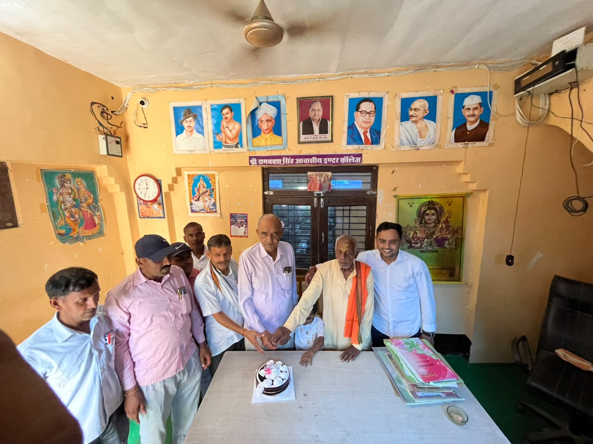
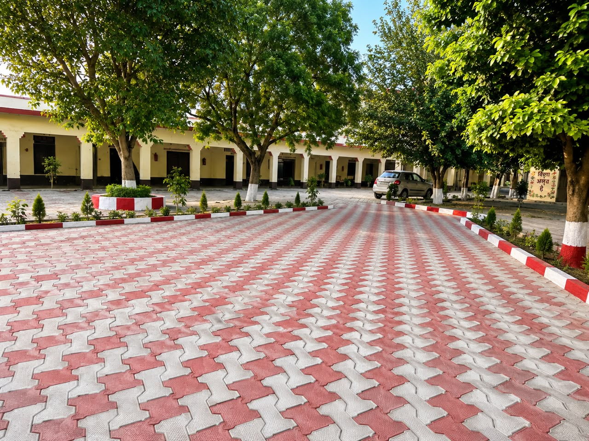

<!DOCTYPE html>
<html lang="hi">
<head>
  <meta charset="UTF-8">
  <meta name="viewport" content="width=device-width, initial-scale=1.0">

  <!-- =========================================================
       गूगल सर्च कंसोल वेरिफिकेशन एवं एसईओ (SEO) मेटा टैग
  ========================================================= -->
  <meta name="google-site-verification" content="78a2tK-I-diBpBECvLtvj41eP3zxS2O0BCBENKQFmLA" />
  <title>श्री रामबक्स सिंह आवासीय इण्टर कॉलेज - बिथरा, अलीगंज (एटा)</title>
  <meta name="description" content="श्री रामबक्स सिंह आवासीय इण्टर कॉलेज, बिथरा - सराय रोड, अलीगंज, एटा (207247)। कक्षा 1 से 12 तक मान्यता प्राप्त, सर्वसुविधायुक्त हॉस्टल, स्मार्ट कक्षाएं एवं खेल मैदान। प्रबंधक: श्री विष्णु कांत, निदेशक: श्री अवधेश सिंह, प्रधानाचार्य: श्री महादेव शंकर। संपर्क: 6395052394, 9758639729।">
  <meta name="keywords" content="श्री रामबक्स सिंह आवासीय इण्टर कॉलेज, रामबक्स सिंह कॉलेज बिथरा, RBS Inter College Aliganj, अलीगंज एटा कॉलेज, हॉस्टल स्कूल एटा, Vishnu Kant Manager, Avadhesh Singh Director, Mahadev Shankar Principal, 207247">
  <meta name="author" content="श्री रामबक्स सिंह आवासीय इण्टर कॉलेज">
  <meta name="robots" content="index, follow">
  <meta name="geo.region" content="IN-UP">
  <meta name="geo.placename" content="बिथरा, अलीगंज, एटा">

  <!-- सोशल मीडिया शेयरिंग मेटा टैग -->
  <meta property="og:title" content="श्री रामबक्स सिंह आवासीय इण्टर कॉलेज - बिथरा, अलीगंज (एटा)">
  <meta property="og:description" content="कक्षा 1 से 12 तक उत्तम शिक्षा एवं सुरक्षित आवासीय हॉस्टल व्यवस्था। प्रवेश प्रारंभ।">
  <meta property="og:image" content="rbslogo.jpeg">
  <meta property="og:type" content="website">

  <!-- गूगल स्ट्रक्चर्ड डेटा (Schema JSON-LD) -->
  

  <!-- फॉन्ट और स्टाइल लाइब्रेरी -->
  <link href="https://cdnjs.cloudflare.com/ajax/libs/font-awesome/6.4.0/css/all.min.css" rel="stylesheet">
  <link href="https://cdnjs.cloudflare.com/ajax/libs/aos/2.3.4/aos.css" rel="stylesheet">
  <link rel="stylesheet" href="https://cdn.jsdelivr.net/npm/swiper@11/swiper-bundle.min.css" />

  
</head>
<body>

  <!-- शीर्ष पट्टी (Top Ribbon) -->
  

    

      <i class="fas fa-map-marker-alt"></i> बिथरा - सराय रोड, अलीगंज, एटा - 207247 (उ.प्र.)
      <i class="fas fa-phone"></i> हेल्पलाइन: 6395052394[cite: 1] / 9758639729
    

    

      <i class="fas fa-bed"></i> आवासीय छात्रावास (कक्षा 1 से 12)
      <i class="fas fa-calendar-alt"></i> सत्र: <strong id="liveSessionBadge">2026-27</strong>
      <a href="javascript:void(0)" onclick="trigger3DLoginCinematic()"><i class="fas fa-user-lock"></i> पोर्टल लॉगिन</a>
    

  

  <!-- मुख्य हेडर -->
  <header>
    

      
      

        <h1>श्री रामबक्स सिंह आवासीय इण्टर कॉलेज</h1>
        
मान्यता प्राप्त - कक्षा 1 से 12 तक (माध्यमिक शिक्षा परिषद्, प्रयागराज) बिथरा, अलीगंज (एटा)

      

    

    
    

      
      
      
    

  </header>

  <!-- स्लाइडिंग मेनू (Drawer Nav) -->
  

    
&times;

    

      <h3 style="color: var(--secondary); font-size: 19px;">मुख्य मेनू</h3>
      
कक्षा 1 से 12 एवं आवासीय छात्रावास

    

    <ul>
      <li><a href="#" onclick="toggleDrawerNav()"><i class="fas fa-home"></i> मुख्य पृष्ठ (Home)</a></li>
      <li><a href="#leadership" onclick="toggleDrawerNav()"><i class="fas fa-user-tie"></i> विद्यालय प्रशासन (Management)</a></li>
      <li><a href="#facilities" onclick="toggleDrawerNav()"><i class="fas fa-school"></i> शैक्षणिक सुविधाएं</a></li>
      <li><a href="#hostel" onclick="toggleDrawerNav()"><i class="fas fa-hotel"></i> छात्रावास व्यवस्था</a></li>
      <li><a href="#gallery" onclick="toggleDrawerNav()"><i class="fas fa-photo-video"></i> फोटो एवं वीडियो गैलरी</a></li>
      <li><a href="#admission" onclick="toggleDrawerNav()"><i class="fas fa-file-signature"></i> ऑनलाइन प्रवेश आवेदन</a></li>
      <li><a href="javascript:void(0)" onclick="toggleDrawerNav(); trigger3DLoginCinematic();" style="color: var(--secondary);"><i class="fas fa-sign-in-alt"></i> ऑनलाइन पोर्टल लॉगिन</a></li>
    </ul>
  

  <!-- ताजा सूचना पट्टी (Ticker) -->
  

    
<i class="fas fa-bullhorn"></i> आवश्यक सूचना

    

      <marquee scrollamount="6">
        नए शैक्षणिक सत्र के लिए कक्षा 1 से 12 तक प्रवेश प्रारंभ हैं • आवासीय छात्रावास (Hostel) सुविधा उपलब्ध • फॉर्मेटिव (FA) एवं समेटिव (SA) परीक्षा परिणाम पोर्टल पर उपलब्ध • संपर्क सूत्र: 6395052394[cite: 1], 9758639729.
      </marquee>
    

  

  <!-- डीपीएस द्वारका स्टाइल स्वच्छ पारदर्शी स्लाइडर -->
  

    

      श्री रामबक्स सिंह आवासीय इण्टर कॉलेज, बिथरा - अलीगंज (एटा)
    

    

      

        

          

        

        

          

        

        

          

        

        

          

        

      

    

  

  <!-- मुख्य कंटेनर -->
  

    <!-- शैक्षणिक सुविधाएं -->
    

      <h2 class="section-heading"><i class="fas fa-award"></i> संस्था की प्रमुख विशेषताएं</h2>
      

        

          <i class="fas fa-laptop-code"></i>
          <h4>स्मार्ट कक्षाएं (Smart Classes)</h4>
          
डिजिटल बोर्ड और आधुनिक शिक्षण पद्धति के साथ गुणवत्तापूर्ण अध्यापन।

        

        

          <i class="fas fa-flask"></i>
          <h4>विज्ञान एवं गणित प्रयोगशाला</h4>
          
प्रायोगिक ज्ञान हेतु सुसज्जित भौतिकी, रसायन एवं जीव विज्ञान प्रयोगशाला।

        

        

          <i class="fas fa-bed"></i>
          <h4>आवासीय छात्रावास (Hostel)</h4>
          
सुरक्षित, अनुशासित एवं नियमित समय-सारिणी युक्त आवासीय व्यवस्था।

        

        

          <i class="fas fa-running"></i>
          <h4>खेलकूद एवं सर्वांगीण विकास</h4>
          
विशाल खेल मैदान, क्रिकेट, वॉलीबॉल, एथलेटिक्स एवं योग प्रशिक्षण।

        

      

    

    <!-- विद्यालय प्रशासन (Leadership) -->
    

      <h2 class="section-heading"><i class="fas fa-users-cog"></i> विद्यालय प्रशासन एवं नेतृत्व</h2>
      

        <!-- निदेशक (Director) -->
        

          
          

            <h3>Mr. Avadhesh Singh</h3>
            
निदेशक (Director)

            
संस्थान में उच्च शैक्षिक गुणवत्ता, मूल्यपरक शिक्षा एवं विद्यार्थियों के चरित्र निर्माण के मुख्य मार्गदर्शक।

          

        

        <!-- प्रबंधक (Manager) -->
        

          
          

            <h3>Mr. Vishnu Kant</h3>
            
प्रबंधक (Manager)

            
<i class="fas fa-phone"></i> +91 6395052394[cite: 1]

            
<i class="fas fa-envelope"></i> rambaxsinghintercollege@gmail.com

            
"कक्षा 1 से 12 तक के प्रत्येक छात्र को अनुशासित वातावरण एवं आधुनिक शिक्षा प्रदान करना हमारी सर्वोच्च प्राथमिकता है।"

          

        

        <!-- प्रधानाचार्य (Principal) -->
        

          
          

            <h3>Mr. Mahadev Shankar</h3>
            
प्रधानाचार्य (Principal)

            
<i class="fas fa-phone"></i> +91 9758639729

            
"विद्यार्थियों के सर्वांगीण बौद्धिक एवं नैतिक विकास हेतु शिक्षकों का निरंतर मार्गदर्शन एवं अनुशासित अध्ययन।"

          

        

      

    

    <!-- आवासीय छात्रावास -->
    

      

        <h2 style="color: var(--primary); margin-bottom: 12px; font-size: 24px;"><i class="fas fa-hotel"></i> आवासीय सुविधा (Residential Hostel - कक्षा 1 से 12)</h2>
        
दूर-दराज के छात्रों के लिए कॉलेज परिसर में ही सुरक्षित एवं सर्वसुविधायुक्त छात्रावास की व्यवस्था है:

        <ul style="margin-left: 20px; line-height: 2;">
          <li>शुद्ध एवं पौष्टिक भोजन (मेस व्यवस्था)</li>
          <li>नियमित अध्ययन समय-सारिणी एवं शाम को विशेष संशय निवारण कक्षाएं</li>
          <li>अनुभवी अध्यापकों की देखरेख में अनुशासित दिनचर्या</li>
          <li>सीसीटीवी एवं 24 घंटे सुरक्षा व्यवस्था</li>
        </ul>
      

      

        
      

    

    <!-- फोटो एवं वीडियो गैलरी -->
    

      <h2 class="section-heading"><i class="fas fa-photo-video"></i> कॉलेज परिसर एवं सांस्कृतिक गतिविधियां</h2>
      

    

    <!-- ऑनलाइन प्रवेश फॉर्म -->
    

      <h2 style="color: var(--primary); margin-bottom: 6px;"><i class="fas fa-user-plus"></i> ऑनलाइन प्रवेश आवेदन पत्र (कक्षा 1 से 12)</h2>
      
फॉर्म जमा करते ही संपूर्ण विवरण सीधे विद्यालय के एडमिन पोर्टल में दर्ज हो जाएगा।

      
      <form onsubmit="handleAdmissionSubmit(event)" id="admForm">
        

          
<label>विद्यार्थी का नाम (Student Name) *</label><input type="text" id="adm_name" required placeholder="पूरा नाम दर्ज करें">

          
<label>पिता का नाम (Father's Name) *</label><input type="text" id="adm_father" required placeholder="पिता का नाम">

          
<label>प्रवेश हेतु कक्षा (Class) *</label>
            <select id="adm_class" required>
              <option value="">-- कक्षा चुनें --</option>
              <option value="कक्षा 1">कक्षा 1</option>
              <option value="कक्षा 2">कक्षा 2</option>
              <option value="कक्षा 3">कक्षा 3</option>
              <option value="कक्षा 4">कक्षा 4</option>
              <option value="कक्षा 5">कक्षा 5</option>
              <option value="कक्षा 6">कक्षा 6</option>
              <option value="कक्षा 7">कक्षा 7</option>
              <option value="कक्षा 8">कक्षा 8</option>
              <option value="कक्षा 9">कक्षा 9</option>
              <option value="कक्षा 10">कक्षा 10 (हाईस्कूल)</option>
              <option value="कक्षा 11">कक्षा 11</option>
              <option value="कक्षा 12">कक्षा 12 (इंटरमीडिएट)</option>
            </select>
          

          
<label>मोबाइल नंबर (Mobile No.) *</label><input type="tel" id="adm_phone" required pattern="[0-9]{10}" placeholder="10 अंकों का मोबाइल नंबर">

          
<label>क्या छात्रावास (Hostel) चाहिए? *</label>
            <select id="adm_hostel" required>
              <option value="नहीं">नहीं (Day Scholar)</option>
              <option value="हाँ">हाँ (छात्रावास आवश्यक)</option>
            </select>
          

          
<label>स्थायी पता (Address) *</label><textarea id="adm_addr" rows="2" required placeholder="ग्राम, पोस्ट, तहसील, जिला, पिन कोड"></textarea>

        

        

          <button type="submit" class="btn-gold"><i class="fas fa-paper-plane"></i> आवेदन पत्र जमा करें</button>
        

      </form>
    

    <!-- सक्रिय प्रबंधन डैशबोर्ड (Admin, Staff, Student) -->
    

      

        

          <h2 style="color: var(--primary);" id="dashTitle">नियंत्रण कक्ष (Control Panel)</h2>
          
लॉगिन उपयोगकर्ता: <strong id="dashUser"></strong>

        

        <button class="btn-gold" style="background: #ef4444; color: #fff;" onclick="logoutPortal()"><i class="fas fa-sign-out-alt"></i> लॉगआउट करें</button>
      

      

      <!-- टैब: प्रवेश आवेदन (Admissions) -->
      

        <h3><i class="fas fa-inbox"></i> प्राप्त ऑनलाइन प्रवेश आवेदन</h3>
        <table id="admTable">
          <thead><tr><th>आईडी</th><th>छात्र का नाम</th><th>पिता का नाम</th><th>कक्षा</th><th>मोबाइल</th><th>हॉस्टल</th><th>पता</th><th>कार्यवाई</th></tr></thead>
          <tbody></tbody>
        </table>
      

      <!-- टैब: शिक्षक एवं स्टाफ प्रबंधन -->
      

        <h3><i class="fas fa-chalkboard-teacher"></i> शिक्षक / स्टाफ खाता नियंत्रण</h3>
        

          <h4>नया शिक्षक खाता जोड़ें (केवल एडमिन द्वारा)</h4>
          

            <input type="text" id="add_staff_name" placeholder="शिक्षक का नाम" style="padding: 8px;">
            <input type="text" id="add_staff_subject" placeholder="विषय / कक्षा" style="padding: 8px;">
            <input type="text" id="add_staff_id" placeholder="लॉगिन आईडी बनाएं" style="padding: 8px;">
            <input type="text" id="add_staff_pass" placeholder="पासवर्ड बनाएं" style="padding: 8px;">
            <button class="btn-gold" onclick="adminAddStaff()"><i class="fas fa-plus"></i> खाता बनाएं</button>
          

        

        <table id="staffTable">
          <thead><tr><th>शिक्षक का नाम</th><th>विषय/कक्षा</th><th>लॉगिन आईडी</th><th>पासवर्ड</th><th>कार्यवाई</th></tr></thead>
          <tbody></tbody>
        </table>
      

      <!-- टैब: छात्र रिकॉर्ड एवं अंकपत्र लॉक/अनलॉक -->
      

        <h3><i class="fas fa-user-graduate"></i> छात्र रिकॉर्ड एवं अंकपत्र अनलॉक नियंत्रण</h3>
        

          <h4>नया छात्र पंजीकृत करें</h4>
          

            <input type="text" id="add_st_roll" placeholder="अनुक्रमांक (Roll No)" style="width: 140px; padding: 8px;">
            <input type="text" id="add_st_name" placeholder="छात्र का नाम" style="padding: 8px;">
            <input type="text" id="add_st_father" placeholder="पिता का नाम" style="padding: 8px;">
            <select id="add_st_class" style="padding: 8px;">
              <option value="कक्षा 1">कक्षा 1</option><option value="कक्षा 2">कक्षा 2</option><option value="कक्षा 3">कक्षा 3</option><option value="कक्षा 4">कक्षा 4</option><option value="कक्षा 5">कक्षा 5</option><option value="कक्षा 6">कक्षा 6</option><option value="कक्षा 7">कक्षा 7</option><option value="कक्षा 8">कक्षा 8</option><option value="कक्षा 9">कक्षा 9</option><option value="कक्षा 10">कक्षा 10</option><option value="कक्षा 11">कक्षा 11</option><option value="कक्षा 12">कक्षा 12</option>
            </select>
            <input type="text" id="add_st_addr" placeholder="पता" style="padding: 8px;">
            <input type="text" id="add_st_pass" placeholder="पासवर्ड" style="padding: 8px; width: 120px;">
            <button class="btn-gold" onclick="adminAddStudent()"><i class="fas fa-plus"></i> छात्र जोड़ें</button>
          

        

        <table id="studentsTable">
          <thead><tr><th>अनुक्रमांक</th><th>छात्र का नाम</th><th>पिता का नाम</th><th>कक्षा</th><th>पता</th><th>पासवर्ड</th><th>अंकपत्र स्थिति</th><th>कार्यवाई</th></tr></thead>
          <tbody></tbody>
        </table>
      

      <!-- टैब: मीडिया प्रबंधक (Photos & Videos) -->
      

        <h3><i class="fas fa-photo-video"></i> वेबसाइट फोटो एवं वीडियो प्रबंधन</h3>
        

          <h4 style="color: var(--primary); margin-bottom: 10px;"><i class="fas fa-plus-circle"></i> नई फोटो अथवा वीडियो अपलोड करें</h4>
          

            

              <label>मीडिया का प्रकार</label>
              <select id="media_type" onchange="toggleMediaInputType()">
                <option value="photo_file">कंप्यूटर/मोबाइल से फोटो अपलोड करें</option>
                <option value="photo_url">फोटो लिंक / फाइल का नाम</option>
                <option value="video_youtube">यूट्यूब वीडियो लिंक (YouTube Link)</option>
                <option value="video_mp4">सीधा वीडियो लिंक (.mp4)</option>
              </select>
            

            
<label>शीर्षक / विवरण (Caption)</label><input type="text" id="media_title" placeholder="उदा. विज्ञान प्रयोगशाला / वार्षिक उत्सव">

            
<label>फोटो फाइल चुनें</label><input type="file" id="media_file_input" accept="image/*">

            
<label id="lbl_media_url">मीडिया लिंक</label><input type="text" id="media_url_input" placeholder="https://...">

          

          
<button class="btn-gold" onclick="addNewMediaItem()"><i class="fas fa-upload"></i> वेबसाइट पर प्रकाशित करें</button>

        

        <h4>वेबसाइट पर वर्तमान फोटो एवं वीडियो</h4>
        <table id="mediaTable">
          <thead><tr><th>प्रकार</th><th>झलक</th><th>शीर्षक</th><th>कार्यवाई</th></tr></thead>
          <tbody></tbody>
        </table>
      

      <!-- टैब: शैक्षणिक सत्र प्रबंधन (Session Manager) -->
      

        <h3><i class="fas fa-calendar-alt"></i> शैक्षणिक सत्र प्रबंधक</h3>
        

          

            <label style="font-size: 13px; font-weight: 700; display: block; margin-bottom: 5px;">सक्रिय शैक्षणिक सत्र</label>
            <input type="text" id="custom_session_input" style="width: 100%; padding: 10px; border: 1px solid #cbd5e1; border-radius: 4px; font-size: 15px; font-weight: bold;">
          

          

            <button class="btn-gold" onclick="saveAdminSession()"><i class="fas fa-save"></i> सत्र सुरक्षित करें</button>
            <button class="btn-gold" style="background: #0284c7; color: #fff;" onclick="resetAutoSession()"><i class="fas fa-sync"></i> स्वतः गणना पर सेट करें</button>
          

        

      

      <!-- टैब: अंक प्रविष्टि (Marks Entry - FA1 to SA2) -->
      

        <h3><i class="fas fa-edit"></i> परीक्षा अंक प्रविष्टि (FA1, FA2, SA1, FA3, FA4, SA2)</h3>
        
अध्यापक कृपया छात्र का नाम, पिता का नाम, कक्षा एवं अनुक्रमांक अनिवार्य रूप से भरें:

        

          
<label>सत्र *</label><input type="text" id="me_session" readonly style="background:#eef2f5;">

          
<label>परीक्षा का प्रकार *</label>
            <select id="me_exam">
              <option value="FA1">FA 1 (प्रथम इकाई परीक्षा)</option>
              <option value="FA2">FA 2 (द्वितीय इकाई परीक्षा)</option>
              <option value="SA1">SA 1 (अर्धवार्षिक परीक्षा)</option>
              <option value="FA3">FA 3 (तृतीय इकाई परीक्षा)</option>
              <option value="FA4">FA 4 (चतुर्थ इकाई परीक्षा)</option>
              <option value="SA2">SA 2 (वार्षिक परीक्षा)</option>
            </select>
          

          
<label>कक्षा (1 से 12) *</label>
            <select id="me_class">
              <option value="">-- कक्षा चुनें --</option>
              <option value="कक्षा 1">कक्षा 1</option><option value="कक्षा 2">कक्षा 2</option><option value="कक्षा 3">कक्षा 3</option><option value="कक्षा 4">कक्षा 4</option><option value="कक्षा 5">कक्षा 5</option><option value="कक्षा 6">कक्षा 6</option><option value="कक्षा 7">कक्षा 7</option><option value="कक्षा 8">कक्षा 8</option><option value="कक्षा 9">कक्षा 9</option><option value="कक्षा 10">कक्षा 10</option><option value="कक्षा 11">कक्षा 11</option><option value="कक्षा 12">कक्षा 12</option>
            </select>
          

          
<label>अनुक्रमांक (Roll No.) *</label><input type="text" id="me_roll" placeholder="अनुक्रमांक दर्ज करें" required>

          
<label>छात्र का नाम *</label><input type="text" id="me_name" placeholder="छात्र का नाम" required>

          
<label>पिता का नाम *</label><input type="text" id="me_father" placeholder="पिता का नाम" required>

        

        <h4 style="margin-top: 20px; color: var(--primary);"><i class="fas fa-book"></i> प्राप्तांक दर्ज करें (पूर्णांक: 100)</h4>
        

          
<label>हिंदी (Hindi)</label><input type="number" id="m_hindi" placeholder="0 - 100">

          
<label>अंग्रेजी (English)</label><input type="number" id="m_english" placeholder="0 - 100">

          
<label>गणित (Mathematics)</label><input type="number" id="m_math" placeholder="0 - 100">

          
<label>विज्ञान / पर्यावरण</label><input type="number" id="m_science" placeholder="0 - 100">

          
<label>सामाजिक विज्ञान</label><input type="number" id="m_social" placeholder="0 - 100">

          
<label>चित्रकला / संस्कृत</label><input type="number" id="m_opt" placeholder="0 - 100">

        

        
<button class="btn-gold" onclick="submitTeacherMarks()"><i class="fas fa-save"></i> परीक्षा अंक सुरक्षित करें</button>

      

      <!-- टैब: 1-क्लिक अंकपत्र जनरेटर (Admin Only) -->
      

        <h3><i class="fas fa-award"></i> 1-क्लिक आधिकारिक अंकपत्र तैयार करें (एडमिन नियंत्रण)</h3>
        

          <input type="text" id="admin_ms_roll" placeholder="छात्र का अनुक्रमांक दर्ज करें" style="padding: 8px; width: 220px;">
          <select id="admin_ms_exam" style="padding: 8px;">
            <option value="SA2">वार्षिक परीक्षा (SA 2)</option>
            <option value="SA1">अर्धवार्षिक परीक्षा (SA 1)</option>
            <option value="FA1">इकाई परीक्षा 1 (FA 1)</option>
            <option value="FA2">इकाई परीक्षा 2 (FA 2)</option>
            <option value="FA3">इकाई परीक्षा 3 (FA 3)</option>
            <option value="FA4">इकाई परीक्षा 4 (FA 4)</option>
          </select>
          <button class="btn-gold" onclick="renderPrintableMarksheet()"><i class="fas fa-magic"></i> अंकपत्र बनाएं</button>
        

        

          

          

            
            

              <h2 style="font-size: 21px; color: #081d33;">श्री रामबक्स सिंह आवासीय इण्टर कॉलेज</h2>
              
बिथरा - सराय रोड, अलीगंज (एटा) उ.प्र. - 207247

              
कक्षा 1 से 12 तक मान्यता प्राप्त | माध्यमिक शिक्षा परिषद्, प्रयागराज

              <h3 style="margin-top: 6px; font-size: 16px; text-decoration: underline;" id="out_exam_title">प्रगति पत्रक (PROGRESS REPORT CARD)</h3>
            

            
फोटो

          

          

            
<strong>विद्यार्थी का नाम:</strong> --

            
<strong>अनुक्रमांक (Roll No):</strong> --

            
<strong>पिता का नाम:</strong> --

            
<strong>कक्षा:</strong> --

            
<strong>स्थायी पता:</strong> --

          

          <table>
            <thead><tr><th>विषय</th><th>पूर्णांक</th><th>उत्तीर्णांक</th><th>प्राप्तांक</th><th>श्रेणी / ग्रेड</th></tr></thead>
            <tbody id="out_tbody"></tbody>
            <tfoot>
              <tr style="font-weight: bold; background: #fdfdfd;"><td>कुल योग (TOTAL)</td><td>600</td><td>200</td><td id="out_grand_total">--</td><td id="out_result">--</td></tr>
            </tfoot>
          </table>

          

            
कक्षाध्यापक के हस्ताक्षर

            
परीक्षा प्रभारी के हस्ताक्षर

            

              Mr. Vishnu Kant / Mr. Mahadev Shankar
              प्रबंधक / प्रधानाचार्य हस्ताक्षर
            

          

          

            <button class="btn-gold" onclick="window.print()"><i class="fas fa-print"></i> अंकपत्र प्रिंट करें</button>
          

        

      

      <!-- टैब: छात्र स्वयं का रिकॉर्ड (Student View Only) -->
      

        <h3><i class="fas fa-user-check"></i> मेरा शैक्षणिक रिकॉर्ड</h3>
        

          <h4 style="color: #b91c1c;"><i class="fas fa-lock"></i> अंकपत्र वर्तमान में लॉक है</h4>
          
आपका परीक्षा परिणाम/अंकपत्र अभी विद्यालय प्रशासन द्वारा लॉक है। एडमिन द्वारा अनलॉक किए जाने पर आप इसे यहाँ देख व डाउनलोड कर सकेंगे।

        

        

      

    

  

  <!-- =========================================================
       3D सूटकेस बालक एनीमेशन एवं लॉगिन मॉडल
  ========================================================= -->
  

    

    

      

        

        

          

          

          

        

        

          

          

        

      

      

        

      

    

    

    

      &times;

      

        
<i class="fas fa-user-shield"></i> एडमिन

        
<i class="fas fa-chalkboard-teacher"></i> शिक्षक/स्टाफ

        
<i class="fas fa-user-graduate"></i> विद्यार्थी

      

      

        <h3 id="modalHeading" style="color: var(--primary); font-size: 20px;">एडमिन पोर्टल लॉगिन</h3>
        
श्री रामबक्स सिंह आवासीय इण्टर कॉलेज

      

      <form onsubmit="handlePortalAuth(event)" autocomplete="off">
        

          <label id="lblUser" style="font-size: 13px; font-weight: 700; display: block; margin-bottom: 5px;">एडमिन लॉगिन आईडी</label>
          <input type="text" id="userInput" required autocomplete="off" placeholder="आईडी दर्ज करें" style="width: 100%; padding: 10px; border: 1px solid #cbd5e1; border-radius: 6px; font-size: 14px;">
        

        

          <label style="font-size: 13px; font-weight: 700; display: block; margin-bottom: 5px;">पासवर्ड</label>
          

            <input type="password" id="passInput" required autocomplete="new-password" placeholder="पासवर्ड दर्ज करें" style="width: 100%; padding: 10px; border: 1px solid #cbd5e1; border-radius: 6px; font-size: 14px;">
            <i class="fas fa-eye eye-toggle" onclick="togglePassEye('passInput', this)"></i>
          

        

        <button type="submit" class="btn-gold" style="width: 100%; padding: 12px; font-size: 15px; border-radius: 6px;"><i class="fas fa-key"></i> लॉगिन करें</button>
      </form>
    

  

  <!-- फुटर -->
  <footer>
    

      

        <h4>श्री रामबक्स सिंह आवासीय इण्टर कॉलेज</h4>
        
बिथरा - सराय रोड, अलीगंज, एटा - 207247 (उ.प्र.)

        
<i class="fas fa-phone"></i> 6395052394[cite: 1] / 9758639729

        
<i class="fas fa-envelope"></i> rambaxsinghintercollege@gmail.com

      

      

        <h4>विद्यालय प्रशासन</h4>
        
<strong>निदेशक:</strong> Mr. Avadhesh Singh

        
<strong>प्रबंधक:</strong> Mr. Vishnu Kant

        
<strong>प्रधानाचार्य:</strong> Mr. Mahadev Shankar

        
संबद्धता: माध्यमिक शिक्षा परिषद्, प्रयागराज (उ.प्र.)

      

      

        <h4>त्वरित लिंक्स</h4>
        
<a href="javascript:void(0)" onclick="trigger3DLoginCinematic()" style="color: var(--secondary); text-decoration: none;">सुरक्षित पोर्टल लॉगिन</a>

        
<a href="#admission" style="color: #fff; text-decoration: none;">ऑनलाइन प्रवेश आवेदन</a>

        
<a href="#hostel" style="color: #fff; text-decoration: none;">छात्रावास जानकारी</a>

      

    

    

      &copy; सर्वाधिकार सुरक्षित - श्री रामबक्स सिंह आवासीय इण्टर कॉलेज, बिथरा, अलीगंज (एटा) - 207247
    

  </footer>

  <!-- जावास्क्रिप्ट लाइब्रेरी -->
  
  

  
</body>
</html>
